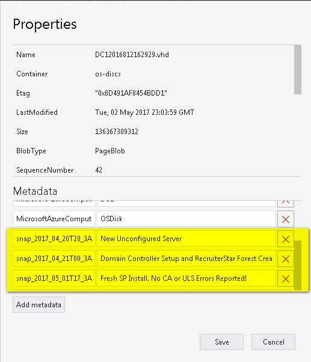

# Introduction

This set of scripts contains the following folders and content.

---

## Folder: ARM-Templates

* ARM Templates to deploy a multi-server SharePoint farm to Azure Resource Group

* Will deploy the following Servers

  1. Domain Controller
  2. SQL Server
  3. Application _(Min-Role Server)_
  4. Distributed Cache _(Min-Role Server)_
  5. Search _(Min-Role Server)_
  6. Web Front End _(Min-Role Server)_

_Note: The Servers  will be based on a sys-prepped image you must have in your resource group storage account._

__azuredeploy.json__

* This is the ARM template that defines all the Resource Group objects to be created.  Most parameters
have default values which are overwritten by the azuredeploy.parameters.json file.

__azuredeploy.parameters.json__

* This is the ARM template parameters.  Update this file according to your environment.

---

## Folder: DSC

__Common_Variables.ps1__
These are variables used by the Deploy.ps1 file which deploys the DSC Resources to each server.

Each sub-folder here contains three PowerShell files

___Deploy.ps1___

* This file used to deploy the DSC script also located in same folder

___InstallResources.ps1___

* This file used to install all the DSC Resources used by the DSC script.

___SP-*****-DSC.ps1___

* This is the DSC file used to configure the server.

## Folder: DSC\SP-DC1\PowerShell Tools

__Setup-GroupManagedServiceAccount.ps1__

* PowerShell snippet used for setting up Group Managed Service Accounts (GMSA)
_(This is a work in progress!)_

---

## Folder: Utility Scripts/Azure Tenant
Scripts related to Azure Tenant.

__Get-AzureCpuQuota.ps1__

* Will return the CPU quota you have in your Azure Account per region.

---

## Folder: Utility Scripts/Azure Blob

__AzCopyCommandBuilder.ps1__

* PowerShell snippet used to create an AzCopy command that can be pasted into the 
[Azure Storage command line utlity](https://docs.microsoft.com/en-us/cli/azure/install-azure-cli).

---

## Folder: Utility Scripts/Azure Work in-progress Scripts

* Code Tim Odell is noodling on.  __Be very afraid!__

---

## Folder: Utility Scripts/Git

__git.config.txt__

* Various git commands 

---

## Folder: Utility Scripts/Key Vault

__KeyVault.ps1__

* PowerShell snippet use to securely store passwords in the Azure Key Vault

---

## Folder: Utility Scripts/Other

__BigInfoFormat.txt__

* A nice format to paste into System Internals [bginfo.exe](https://live.sysinternals.com/Bginfo.exe).  It is recomended to run [bginfo.exe](https://live.sysinternals.com/Bginfo.exe) on each of your virtual machines. 

---

## Folder: Utility Scripts/SharePoint/StartStopServices

__Get-RunningSPServices.ps1__

* PowerShell function returns list of services running services by providing the services you wish to examine and a list of servers to scan.  This function run by the Main.ps1 file also in this folder.

__Main.ps1__

* Main program from which to start or stop SharePoint services.  You must manually un-comment starting and stopping lines near bottom of the script.

__SharePoint-ServerNameList.ps1__

* PowerShell snippet used to create a list of Servers in your farm.  Used by the Main.ps1 filed or other files you may make later on.

__Start-SPServices.ps1__

* PowerShell function used to Start SharePoint services.  This function is called by the Main.ps1 file.

__Stop-SPServices.ps1__

* PowerShell function used to Stop SharePoint services.  This function is called by the Main.ps1 file.

---

## Folder: Utility Scripts/SnapShot

__Snap-Vm-Run.ps1__

* Runs the Snap-Vm.ps1 file which creates snapshot of the OsDisk for the provided servers.

__Snap-Vm.ps1__

* Creates a snapshot of the provided Virtual Machine's OsDisk and adds meta-data
    entry on the OsDisk blob containing the name of the snapshot and a note you wish
    to add about that snapshot.  The note will help you identify the snapshot so you
    easily find it for restoration.

* Here is an example of the recorded snapshot and metadata note added to a OsDisc blob as visible in the [Microsoft Azure Storage Explorer](http://storageexplorer.com/) 

	 

---

## Folder: Utility Scripts/Windows

__Get-ListeningTCPConnections.ps1__

* A helpful PowerShell function used to list all the tcp ports a Windows machine is listening on. 

__TestDomainCred.ps1_
* PowerShell snippet use to test the validity of a user name